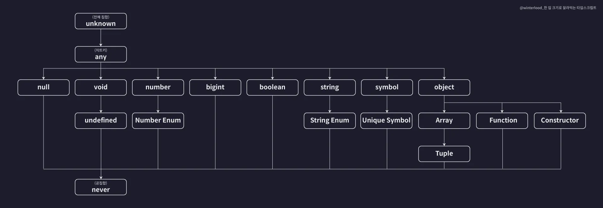

# 타입스크립트 이해하기

## 타입은 집합이다

만약 number Type 이라면 어떤 숫자든 가능하다.  
하지만 number Literal Type이라면?

```tsx
let num: 20 = 20;
```

number Type의 부분집합이 되는 것.  
이럴 때 number Type을 슈퍼타입(부모타입)이라 하고 number literal Type을 서브타입(자식타입)이라고 한다.

서브타입을 슈퍼타입에게 대입시키는 것을 업 캐스팅(Up Cast)라 하고 슈퍼타입을 서브타입에게 대입하는 것을 다운 캐스팅(Down Cast)라 한다.

```tsx
let num1: number = 10;
let num2: 10 = 10;

// 업 캐스팅(가능)
num1 = num2;

// 다운 캐스팅 (불가능)
// 왜냐하면 number Type이기 때문에 현재는 10이지만 나중에는 어떠한 숫자가 들어올지 모른다.
num2 = num1; // 에러
```

### 타입 계층도



<small>출처 : 한 입 크기로 잘라먹는 타입스크립트</small>

<br>
<br>

## 객체 타입의 호환성

어떤 객체타입을 다른 객체타입으로 취급해도 괜찮은가?

```tsx
type Animal = {
  name: string;
  color: string;
};

type Dog = {
  name: string;
  color: string;
  bread: string;
};

let animal: Animal = {
  name: "기린",
  color: "yellow",
};

let dog: Dog = {
  name: "돌돌이",
  color: "brown",
  bread: "진도",
};

animal = dog;
dog = animal; // 에러
```

여기선 Animal이 슈퍼타입, Dog는 서브타입이 됨.  
하지만 아래처럼 하면 안됨.

```tsx
let dog2: Animal = {
  name: "댕댕이",
  color: "white",
  bread: "시츄",
};
```

`animal = dog` 는 되고, `let dog2: Animal` 은 안된다?

이유는 초과 프로퍼티를 검사하기 때문임.  
초과 프로퍼티 검사 = 실제로 정의하지 않은 프로퍼티를 작성하지 못하도록 막는 검사  
그래도 breed를 사용하고 싶다면?

```tsx
let dog2: Animal = dog;
```

변수를 전달해야 한다. 함수도 마찬가지

```tsx
function func(dog: Animal) {}

func({
  name: "댕댕이",
  color: "white",
  // bread: "시츄",
});

// 그래서 변수로 전달해야함
func(dog2);
```

<br>
<br>

## 대수 타입

여러 개의 타입을 합성해서 새롭게 만들어낸 타입.  
합집합 타입과 교집합 타입이 존재한다.

### 합집합 - Union Type

```tsx
// 합집합 - Union 타입
let a: string | number;
a = 1;
a = "hello";
```

타입은 무한으로 추가할 수 있다.

```tsx
let a: string | number | boolean | undefined | null | {};
```

배열에서도 사용 가능하다.

```tsx
let arr: (number | string | boolean)[] = [1, "hello", true];
```

객체에서도 사용 가능하다.

```tsx
type Dog = {
  name: string;
  color: string;
};

type Person = {
  name: string;
  language: string;
};

// Union 타입인 새로운 타입 변수 만들어 줌
type Union1 = Dog | Person;

// 새로운 타입을 사용
let union1: Union1 = {
  name: "",
  color: "",
};

let union2: Union1 = {
  name: "",
  language: "",
};

// 모든 속성을 사용해도 에러가 나지 않음
let union3: Union1 = {
  name: "",
  color: "",
  language: "",
};

// 하지만 하나의 속성만 사용하면 에러가 남
// let union4: Union1 = {
//   name: "",
// };
```

union4가 에러가 나는 이유를 알아보자.


속성으로 보는 것이 아닌 타입 전체를 확인해야 한다.

union4가 name 속성만 있다해서 교집합에 포함되는 것이 아니라, color타입이 없어 Dog Type도 아니고 language타입이 없어 Person Type도 아니게 되어 어떤 타입에도 포함이 되지 않는 것이다.

### 교집합 - Intersection Type

```tsx
let variable: number & string;
```

number와 string은 겹치는 것이 없기 때문제 공집합으로 볼 수 있다.  
그래서 교집합은 보통 `never` 타입이다.  
그래서 객체 타입에 자주 사용한다.  
위의 Dog와 Person 타입을 한 번더 이용해보자.

```tsx
type Intersection = Dog & Person;

let intersection1: Intersection = {
  name: "",
  color: "",
  language: "",
};
```

만약 intersection1에서 속성이 하나라도 빠지게 되면 에러가 난다.

왜냐하면 `Intersection` 타입은 모든 속성을 갖는 union3같은 교집합을 만들어낸 것이기 때문이다.

<br>
<br>

## 타입 추론

타입스크립트는 타입을 따로 지정하지 않아도 추론해주는데, 추론해주는 기준은 변수의 초기값이다.

함수의 반환값은 그 반환값을 기준으로 추론한다. 매개변수는 만약 기본값이 설정되어 있다면, 기본값을 기준으로 추론한다.

```tsx
let a = 10;
let b = "hello";

let c = {
  id: 1,
  name: "yooni",
  profile: {
    nickname: "yooooon",
  },
  urls: ["https://yooniverse42.com"],
};

// 구조 분해 할당에서도 추론이 잘 된다.
let { id, name, profile } = c;

let [one, two, three] = [1, "hello", true];

// 함수
function func(message = "hello") {
  return "hello";
}
```

하지만 생각과 다르게 추론 될 때도 있다.

```tsx
let d; // (1)
d = 10; // (2)
d.toFixed(); // (3)
// d.toUpperCase(); // 에러
```

(1)에서는 any타입으로 잡히지만 (2)에서 숫자를 대입함으로서 number타입으로 변경이 된다. 그래서 (3)과 같이 number타입에서 사용 가능한 메서드는 에러가 나지 않지만, 문자열 메서드를 사용하면 에러가 난다.

하지만 d에 문자열을 대입하면 다시 문자열로 변경이 된다.

```tsx
let d;
d = 10;
d.toFixed();

d = "hello"; // 문자열 타입으로 변경된다.
d.toUpperCase(); // 에러가 나지 않는다.
// d.toFixed(); // 에러
```

이런 상황을 any타입의 진화하고 한다.  
만약 let이 아닌 const라면?

```tsx
const num = 10;
const str = "hello";
```

const는 상수여서 값이 변하지 않는다. 그래서 따로 number타입이나 string타입으로 지정이 되는게 아니라 리터럴 타입으로 지정이 된다.

<br>
<br>

## 타입 단언

먼저 빈 객체를 만들고 나중에 객체를 추가하고 싶을 땐 어떻게 해야 할까?

```tsx
let person: Person = {}; // 에러

person.name = "이정환";
person.age = 27;
```

이렇게 하면 person객체 안에 아무것도 없어서 에러가 나게 된다.

any타입은 웬만하면 사용하면 안되니 타입을 없어버리면?

```tsx
let person = {};

person.name = "이정환"; // 에러
person.age = 27; // 에러
```

person객체는 빈객체로 타입을 추론해버려서, 추가할 때 에러가 나게 된다.

이때 사용할 수 있는 것이 `as ~`

```tsx
let person = {} as Person;

person.name = "이정환";
person.age = 27;
```

Person타입으로 간주해라고 알려준다. = 타입 단언

또 다른 예시

```tsx
type Dog = {
  name: string;
  color: string;
};

let dog: Dog = {
  name: "돌돌이",
  color: "brown",
  bread: "진도", // 에러
};
```

이런 상황에서도 타입 단언을 쓰면 된다

```tsx
let dog: Dog = {
  name: "돌돌이",
  color: "brown",
  bread: "진도",
} as Dog;

// 또는
let dog = {
  name: "돌돌이",
  color: "brown",
  bread: "진도",
} as Dog;
```

### 타입 단언의 규칙

단언식 : 값 as 단언  
A as B일 때 A가 B의 슈퍼타입이거나 서브타입이어야 함.

```tsx
let num1 = 10 as never;
let num2 = 10 as unknown;
let num3 = 10 as string; // 에러
```

만약 num3를 에러나지 않게 하는 방법도 있음. (다중 단언)

```tsx
let num3 = 10 as unknown as string;
```

이렇게 하면 `10 as unknown` 가 unknown으로 되고(A) string은 unknown의 서브 타입이라서 에러가 나지 않는다. 하지만 정말 필요할 때만 사용하고 웬만하면 사용하지 않는 것을 추천..

### const 단언

```tsx
let num4 = 10 as const;
num4 = 5; // 에러
```

이렇게 const 단언을 사용하게 되면 num4에 할당한 10은 리터럴로 되버려서 num4에 다들 숫자를 할당하려고 하면 에러가 난다.

```tsx
let cat = {
  name: "야옹이",
  color: "yellow",
} as const;

cat.name = "냥냥이"; // 에러
```

이렇게 객체에 const 단언을 하게 되면 객체가 readonly 객체로 추론된다. 그래서 수정하려고 하면 에러가 난다.

### Non Null 단언

```tsx
type Post = {
  title: string;
  author?: string;
};

let post: Post = {
  title: "게시글1",
  author: "yooon",
};

const len: number = post.author?.length; // (1) 에러
```

(1)에서 옵셔널체이닝을 사용함으로써 len변수는 undefined가 될 수도 있다. 근데 number타입에는 undefined가 들어갈 수 없기 때문에 에러가 난다. 이때 Non Null 단언을 해주면 된다.

```tsx
const len: number = post.author!.length;
```

이렇게 작성하면 타입스크립트가 null이나 undefined가 아니라고 믿도록 만든다.

<br>
<br>

## 타입 좁히기

- 조건문 등을 이용해 넓은 타입에서 좁은 타입으로
- 타입을 상황에 따라 좁히는 방법을 이야기함

```tsx
function func(value: number | string) {
  value; // (1)
  // value.toUpperCase(); // 에러
  // value.toFixed() // 에러

  if (typeof value === "number") {
    console.log(value.toFixed()); // (2)
  } else if (typeof value === "string") {
    console.log(value.toUpperCase()); // (3)
  }
}
```

(1)에서 value는 유니온 타입이라 어떠한 toUpperCase나 toFixed메소드를 사용하면 에러가 난다. 하지만 조건문을 통해 타입을 좁히게 되면, 타입스크립트는 타입을 추론하게 되고, 관련 메소드를 사용할 수 있게 된다.

만약 Date 타입을 추가한다면?

```tsx
function func(value: number | string | Date) {
  if (typeof value === "number") {
    console.log(value.toFixed());
  } else if (typeof value === "string") {
    console.log(value.toUpperCase());
  } else if (typeof value === "object") {
    console.log(value.getTime());
  }
}
```

Date는 object이기 이므로 `typeof value === "object"` 로 타입을 좁힐 수 있다.

하지만 여기서 null타입도 추가하게 되면?

```tsx
function func(value: number | string | Date | null) {
  if (typeof value === "number") {
    console.log(value.toFixed());
  } else if (typeof value === "string") {
    console.log(value.toUpperCase());
  } else if (typeof value === "object") {
    // console.log(value.getTime()); // 에러
  }
}
```

마지막 조건문에서 Date, null 모두 "object"가 되고, value값이 null일 수도 있어서 에러가 난다.

그래서 Date 객체임을 보장하기 위해서 instanceof를 사용하면 된다.

```tsx
function func(value: number | string | Date | null) {
  if (typeof value === "number") {
    console.log(value.toFixed());
  } else if (typeof value === "string") {
    console.log(value.toUpperCase());
  } else if (value instanceof Date) {
    console.log(value.getTime());
  }
}
```

만약 내가 새로운 객체 타입을 만든다면?

```tsx
type Person = {
  name: string;
  age: number;
};

function func(value: number | string | Date | null | Person) {
  if (typeof value === "number") {
    console.log(value.toFixed());
  } else if (typeof value === "string") {
    console.log(value.toUpperCase());
  } else if (value instanceof Date) {
    console.log(value.getTime());
  } else if (value instanceof Person) {
    // 에러
    console.log(`${value.name}은 ${value.age}살 입니다.`);
  }
}
```

instanceof는 class의 Instance인지 확인하는 연산자이다. Date는 자바스크립트의 내장 클래스라서 가능하지만 Person은 클래스가 아닌 내가 만든 객체 타입이기 때문에 `value instanceof Person` 자체가 에러가 나는 것이다.

그래서 프로퍼티 in 값을 이용하면 된다.

```tsx
...
  } else if ('age' in value) { // 에러
    console.log(`${value.name}은 ${value.age}살 입니다.`);
  }
}
```

이렇게 해도 에러가 나는 이뉴는 value값이 null일 수도 있기 때문이다. 그래서 타입을 더 좁히면?

```tsx
...
  } else if (value && 'age' in value) {
    console.log(`${value.name}은 ${value.age}살 입니다.`);
  }
}
```

value값이 null이 아닌 값이 있다는 조건을 추가해주면 된다.

<br>
<br>

## 서로소 유니온 타입

교집합이 없는 타입들로만 만든 유니온 타입을 말함

```tsx
type Admin = {
  tag: "ADMIN";
  name: string;
  kickCount: number;
};

type Member = {
  tag: "MEMBER";
  name: string;
  point: number;
};

type Guest = {
  tag: "GUEST";
  name: string;
  visitCount: number;
};

type User = Admin | Member | Guest;
```

tag속성이 없다면 교집합이 생기기 때문에 name, kickCount, point속성을 가지는 객체가 있어서 조건문 활용 시 생각지도 못한 예외상황이 발생할 수도 있다.

하지만 tag속성을 만들어 스트링리터럴로 값을 할당하게 되면 값 자체가 ‘ADMIN’이 아닌 이상 Admin타입의 합집합이든 교집합이든 될 수 없다는 것이다.
