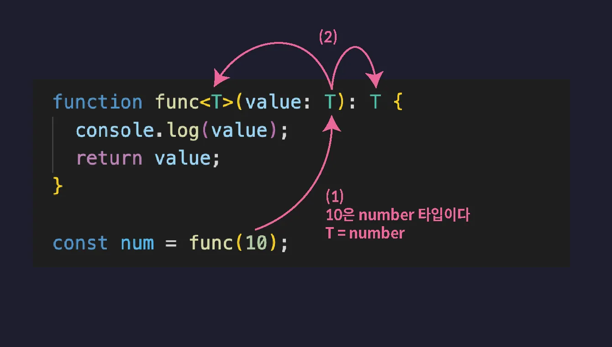

# 제네릭

## 제네릭(Generic)이란?

함수나 인터페이스, 타입 별칭, 클래스 등을 다양한 타입과 함께 동작하도록 만들어 주는 타입스크립트 기능

### 제네릭이 필요한 상황

다양한 타입의 매개변수를 제공받아야 하기 때문에 매개변수 value의 타입을 일단 any 타입으로 설정

```tsx
function func(value: any) {
  return value;
}

let num = func(10);
// any 타입

let str = func("string");
// any 타입
```

매개변수를 다르게 해도 여전히 num과 str은 any 타입임.

이렇게 매개변수 타입에 따라 반환값도 그에 맞는 타입이었으면 좋겠을 때 제네릭 함수를 사용하면 된다.

```tsx
function func<T>(value: T): T {
  return value;
}

let num = func(10);
// number 타입
```



또는 제네릭 함수를 호출할 때 아래와 같이 타입 변수에 할당할 타입을 직접 명시할 수 있다.

```tsx
function func<T>(value: T): T {
  return value;
}

let arr = func<[number, number, number]>([1, 2, 3]);
```

arr은 튜플로 정의가 된다.

<br>
<br>

## 타입 변수 응용하기

### 첫 번째 사례

```tsx
function swap<T>(a: T, b: T) {
  return [b, a];
}

const [a, b] = swap(1, 2);
```

여기서 첫 번째 매개변수를 숫자가 아닌 문자열로 변경한다면?

```tsx
function swap<T>(a: T, b: T) {
  return [b, a];
}

const [a, b] = swap("1", 2); // 에러
```

에러가 나는 이유는 문자열이 첫번째 T에 할당되면서 옆에 있는 b에도 string타입이 할당이 된 것.

그래서 이럴 땐, 타입을 하나 더 선언 해주는 것이다.

```tsx
function swap<T, U>(a: T, b: U) {
  return [b, a];
}

const [a, b] = swap("1", 2);
```

<br>

### 두 번째 사례

```tsx
function returnFirstValue<T>(data: T[]) {
  return data[0];
}

let num = returnFirstValue([0, 1, 2]);
let str = returnFirstValue(["hello", "mynameis"]);
```

배열의 첫 번째 값을 반환하는 함수이다. `T[]` 라고 정의한 이유는 `T` 만 적었을 땐 함수를 호출하지 않으면 Undefined에서 [0]번째를 찾으려고 해서 에러가 난다. 그래서 undefined여도 일단 배열이라는 것을 알려주기 위해 `T[]` 라 정의한 것이다.

현재 사례에서는 문제가 없지만 만약 `let str = returnFirstValue([1, "hello", "mynameis"]);` 으로 변경된다면, str은 첫번째 값이 number인지 string인지 모르기 때문에 number가 아닌 number | string으로 된다. 그래서 아래 처럼 해결하면 된다.

```tsx
function returnFirstValue<T>(data: [T, ...unknown[]]) {
  return data[0];
}

let num = returnFirstValue([0, 1, 2]);
let str = returnFirstValue(["hello", "mynameis"]);
```

현재 사례에서는 배열의 첫 번째 요소만 필요하기 때문에 첫 번째 요소만 T로 정의하고 나머지는 굳이 알 필요가 없으므로 unknown[]으로 정의한 것이다.

<br>

### 세 번째 사례

```tsx
function getLength(data: any) {
  return data.length;
}

let var1 = getLength([1, 2, 3]);
let var2 = getLength("12345");
let var3 = getLength({ length: 10 });
let var4 = getLength(10);
```

var1~3은 제대로 전달하지만 var3는 length가 없지만 에러가 나지 않는다.

그래서 var4와 같은 값들은 전달하지 못하도록 해보자

```tsx
function getLength<T extends { length: number }>(data: T) {
  return data.length;
}

let var1 = getLength([1, 2, 3]);
let var2 = getLength("12345");
let var3 = getLength({ length: 10 });
// let var4 = getLength(10); // 에러
```

length라는 프로퍼티의 타입이 number인 객체를 확장한 T라는 뜻이 된다.

<br>
<br>

## 제네릭 인터페이스

```tsx
interface KeyPair<K, V> {
  key: K;
  value: V;
}

let keyPair: KeyPair<string, number> = {
  key: "key",
  value: 0,
};

let keyPair2: KeyPair<boolean, string[]> = {
  key: true,
  value: ["1"],
};
```

### 인덱스 시그니처와 함께 사용하기

```tsx
interface Map<V> {
  [key: string]: V;
}

let stringMap: Map<string> = {
  key: "value",
};

let booleanMap: Map<boolean> = {
  key: true,
};
```

### 제네릭 타입 별칭

```tsx
type Map2<V> = {
  [key: string]: V;
};

let stringMap2: Map2<string> = {
  key: "hello",
};
```

## 제네릭 클래스

```tsx
class List<T> {
  constructor(private list: T[]) {}

  push(data: T) {
    this.list.push(data);
  }

  pop() {
    return this.list.pop();
  }

  print() {
    console.log(this.list);
  }
}

const numberList = new List([1, 2, 3]);
numberList.pop();
numberList.push(4);
numberList.print();

const strList = new List(["1", "2"]);
strList.push("hello");
```

제네릭 인터페이스와 제네릭 타입 변수와는 다르게 new List 뒤에 타입을 명시해주지 않아도 된다.

<br>
<br>

## 프로미스와 제네릭

resolve는 타입 변수로 비동기 처리의 결과값의 타입을 정의해줄 수 있지만 reject 타입은 정해줄 수 없다.

```tsx
const promise = new Promise<number>((resolve, reject) => {
  setTimeout(() => {
    // resolve(20);
    reject("~ 때문에 실패");
  }, 3000);
});

promise.then((response) => {
  console.log(response * 10); // 20
});

promise.catch((err) => {
  if (typeof err === "string") {
    console.log(err);
  }
});
```

만약 타입을 정의하지 않으면 Unknown타입으로 추론된다.
